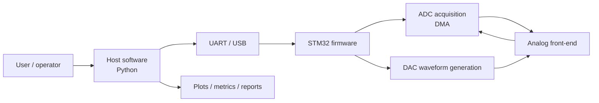

# μATE-STM

Modular Automated Test Equipment for STM32

[](#)
[](#)
[](#)
[](#)

μATE-STM is an open-source, low-cost mixed-signal test instrument for education and research, designed around an STM32-based embedded platform and a Python-based analysis workflow.

## Project Overview

μATE-STM is a planned mixed-signal measurement system intended to support ADC characterization, waveform acquisition, signal processing, and automated reporting. The design is organized around a two-tier architecture: embedded firmware on an STM32 device handles acquisition and communication, while host software on a laptop performs analysis, visualization, and reporting.

## Motivation

Commercial mixed-signal test equipment is often expensive for students, hobbyists, and small research teams. μATE-STM addresses this gap by providing a low-cost, open, and reproducible platform for learning and practicing measurement science, embedded systems, analog front-end design, and signal-analysis methods.

## System Overview

The system is designed as a PC-controlled, embedded test station with the following roles:

- Embedded tier: STM32 firmware for ADC sampling, DAC-based stimulus generation, DMA-assisted data handling, and UART/USB communication.
- Host tier: Python software for command and control, data parsing, signal processing, visualization, and report generation.
- Analog front-end: Breadboard-based conditioning, filtering, and protection circuitry for safe low-voltage measurements.

## Goals

The project is intended to:

- provide an affordable platform for mixed-signal education and experimentation,
- enable ADC and DAC characterization through practical measurements,
- support FFT-based spectral analysis and histogram-based DNL/INL analysis,
- document the complete engineering process in a reproducible form,
- and serve as a modular foundation for future extensions.

## Implemented Features vs. Planned Capabilities

### Implemented in this repository

At the current stage, the repository contains:

- the engineering design dossier,
- repository scaffolding for documentation and project structure,
- and the documentation foundation for the proposed system.

No firmware or host-software implementation is present in the repository yet.

### Planned capabilities

The documented system design includes the following planned capabilities:

- configurable ADC sampling,
- UART-based firmware/host communication,
- DMA-assisted data transfer,
- FFT-based spectral metrics such as THD, SNR, SINAD, SFDR, and ENOB,
- histogram-based DNL and INL analysis,
- offset and gain calibration workflows,
- automated report generation,
- and a verification and validation plan for the full system.

## Repository Structure

```text
μATE-STM/
├── README.md               # Repository landing page
├── docs/                   # Engineering design dossier and references
├── firmware/               # STM32 firmware project structure
├── hardware/               # Schematics, BOM, calculations, and design assets
├── python/                 # Host-side acquisition and analysis modules
├── data/                   # Raw and processed measurement data
├── configs/                # Configuration files
├── examples/               # Example workflows and usage patterns
└── scripts/                # Helper and automation scripts
```

## Technology Stack

- Embedded firmware: C, STM32 HAL/LL, STM32CubeIDE, STM32CubeMX
- Host software: Python 3.9+
- Scientific computing: NumPy, SciPy, Matplotlib
- Communication: UART/serial communication via pyserial
- Documentation: Markdown and engineering design documents
- Version control: Git and GitHub

## Engineering Design Dossier

The repository includes a full engineering design dossier covering architecture, requirements, implementation, verification, and maintenance. The file [docs/engineering-design-dossier/master.md](docs/engineering-design-dossier/master.md) serves as the table of contents for the complete Engineering Design Dossier:

- [Executive Summary](docs/engineering-design-dossier/chapter-01-executive-summary.md)
- [Problem Statement](docs/engineering-design-dossier/chapter-02-problem-statement.md)
- [Project Objectives](docs/engineering-design-dossier/chapter-03-project-objectives.md)
- [Functional Requirements](docs/engineering-design-dossier/chapter-04-functional-requirements.md)
- [Non-Functional Requirements](docs/engineering-design-dossier/chapter-05-non-functional-requirements.md)
- [System Architecture](docs/engineering-design-dossier/chapter-06-system-architecture.md)
- [Hardware Design](docs/engineering-design-dossier/chapter-08-hardware-design.md)
- [Software Design](docs/engineering-design-dossier/chapter-09-software-design.md)
- [Verification and Validation](docs/engineering-design-dossier/chapter-10-verification-validation.md)
- [Mathematical Foundations](docs/engineering-design-dossier/chapter-11-mathematical-foundations.md)
- [Physics](docs/engineering-design-dossier/chapter-12-physics.md)
- [Implementation Guide](docs/engineering-design-dossier/chapter-13-implementation-guide.md)
- [User Manual](docs/engineering-design-dossier/chapter-14-user-manual.md)
- [Developer Manual](docs/engineering-design-dossier/chapter-15-developer-manual.md)
- [Maintenance and Future Development](docs/engineering-design-dossier/chapter-16-maintenance.md)

## Development Roadmap

1. Hardware prototype and analog front-end validation.
2. Firmware implementation for ADC acquisition, DMA handling, and UART communication.
3. Host software development for acquisition, parsing, and analysis.
4. FFT, histogram, DNL/INL, and calibration modules.
5. Reporting, visualization, and verification workflows.
6. Documentation refinement and community-ready release preparation.

## Current Status

The repository currently provides the engineering foundation for the project, including the design dossier and the planned structure for hardware, firmware, and Python modules. The implementation work described in the dossier is planned rather than yet fully realized in the repository contents.

| Area | Status | Notes |
| --- | --- | --- |
| Documentation | Available | Engineering Design Dossier is present in [docs/engineering-design-dossier](docs/engineering-design-dossier) |
| Firmware | Planned | Architecture and requirements are documented; implementation files are not yet present |
| Hardware | Planned | Hardware design scope and constraints are documented |
| Host software | Planned | Analysis and reporting workflow are documented; implementation is not yet present |
| Verification | Planned | Verification and validation procedures are documented in the dossier |

## Future Work

Planned extensions include:

- higher-rate or multi-channel acquisition,
- improved communication throughput,
- more advanced waveform generation and test profiles,
- PCB-based hardware revisions,
- and broader support for analysis and reporting workflows.

## High-Level Architecture

The following diagram illustrates the intended system architecture described in the Engineering Design Dossier.



## Contributing

Contributions are welcome, particularly in the areas of firmware, host software, documentation, and verification. Please keep changes modular, well documented, and consistent with the design dossier.

## License

No license has been declared for this repository yet. A suitable open-source license should be selected before public distribution or reuse.

## Acknowledgements

This project draws on the STM32 ecosystem, the open-source Python scientific stack, and the broader engineering education community. The repository structure and design philosophy are aligned with the documentation contained in the Engineering Design Dossier.
